
# Absent* World Representations

*Absent for me to see, this is not a claim there are none
 
## Intro

### Choosing a model
When I began this project, my first dilemma was deciding which model to work on. I could have chosen a pre-trained model and built upon existing work, which would have provided a head start and seemed like the safer option. However, I chose to train my own model. The main reason was that it seemed like a great learning experience as I haven't trained a model before, and even though this increased the risk of the whole project failing, I was very motivated to give it a try.

### Choosing a problem
I am a huge chess fan, and for a while, I had the idea to train a model to play chess and try to understand what game abstractions it builds. It was inspired by the [Emergent World Representations: Exploring a Sequence Model Trained on a Synthetic Task](https://arxiv.org/abs/2210.13382) (Li et al., 2023) and [Emergent Linear Representations in World Models of Self-Supervised Sequence Models](https://arxiv.org/abs/2309.00941) (Nanda et al., 2023) papers, which showed substantial evidence that models do indeed build game board representations. I had to also consider the fact that that pursuing work closely resembling existing research might be less impactful than exploring a novel direction. However, for this particular project, I wanted to focus on learning and having fun while experimenting with a significant chance of failure and this problem seemed like a very fun thing to work on. I also thought it was unlikely that I would find something groundbreaking on my first try but I thought that if I were find emergent world representations in a chess model I think that would still hold some value. In any case, this seemed like a good project to take risks with as it was time limited. For a 'real world' research I would probably choose to work on something more promising.

### Opening move
The convergence of my decision to train a model from scratch and the aspiration to train it in chess neatly led to the idea to train a model on executing a checkmate using only a knight and a bishop. [The knight and bishop checkmate](https://en.wikipedia.org/wiki/Bishop_and_knight_checkmate) is one of the four basic endgame checkmates but it is deceptively complicated (**even [grandmasters have failed](https://en.wikipedia.org/wiki/Bishop_and_knight_checkmate#Grandmasters_failing_to_mate) to execute it!**). With perfect play, the strong side can force a checkmate in at most 33 moves from any position. The algorithm that needs to be learned involves creating "barriers" with the bishop and knight to drive the opposing king to the edge of the board and then force it into a corner with the same color as the bishop for the checkmate.

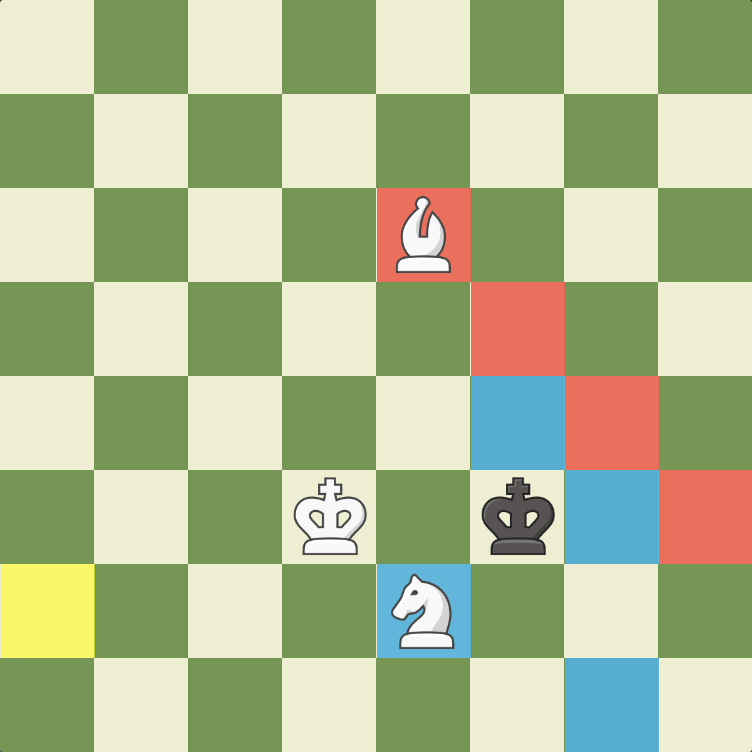

Some napkin calculations show that there are 32 ♗ x  63  ♔ x 62  ♘ x 50♚(estimate) x 2(sides) = **15.5 million possible legal positions**
However the number of possible move sequences is vastly greater, if we consider the [50-move rule](https://en.wikipedia.org/wiki/Fifty-move_rule) and assume that there are 4 possible moves for position, for 50 moves we would have at most **4^100 possible legal move sequences** (surely less as this does not take into account early terminations due to checkmate/stalemate but as the terminal positions are a tiny fraction of all possible positions I have omitted that). My hypothesis is that in order to be able to produce legal move sequences the model will have to build some representation of the game rather than trying to find patters in the sequence.

## Hypotheses

Starting the project I was expecting to see the following things
- A model is able to produce a legal move in 99%+ cases (similar to the Othello model)
- A model is able to checkmate in 90% cases (I suspect that learning the checkmate algorithm is vastly harder than learning the board representation)
- The model will have an internal representations of the positions of the pieces
  - To verify that I can train a linear probe to predict the positions of the pieces from the residual stream of the model
  - Using the linear probe I can modify the internal position to make the king suddenly appear on the other end of the board for example
- The model will have an internal representation of the possible moves/squares attacked by each piece
  - To verify that I can train a linear probe to predict the possible moves from the residual stream of the model
  - Using the linear probe I can make the king move like a knight for example
- The model will have an internal representation when a piece is in 'danger'
  - In theory this can be derived from the previous two (check if the positions of my pieces fall on a possible move by the opponent) but as moving pieces away from danger is such an important part of the algorithm I would expect to see it clearly
- The model will have an induction head to retrieve the last position of each piece. Ideally there will be separate heads for the different pieces which will help me see them clearly but probably it will be a multi-semantic one that will do a bunch of stuff altogether.

<sub>Spoiler alert: I did not find evidence for most of those as you can guess from the title</sub>

## Model

I decided to train a small (3 million parameters) GPT-2-like model with the following parameters:

```python
n_layers = 4,
d_head = 64,
n_heads = 4,
d_model = 64 * 4,
d_mlp = 4 * (64 * 4),
d_vocab = 221,
n_ctx = 100,
act_fn="gelu",
normalization_type="LNPre"
```

This was the first time I was training a model (I'm using this excuse a lot) so I expect a lot of those to be a very sub-optimal but here were my considerations for choosing them:

- I wanted the model to be small enough that I can train it on my home computer
- I was worried that a model that is too big would start to memorize and would not be pressured to generalize
- Basically trying to do what the Othello model did so I kept the activation function and normalization type the same
- I decided that each game can be at most 50 moves long (because of the [50-move rule](https://en.wikipedia.org/wiki/Fifty-move_rule)) so the context length was set to 100. In the dataset I generated the longest game was 77 moves so that could have been lowered
- The vocab was all the possible moves one can make (that appeared in the dataset that I generated) in the [Standard algebraic notation](https://en.wikipedia.org/wiki/Algebraic_notation_(chess)) (eg. 'Bc4') I decided that is better than to create a tuple of all possible squares (eg 'f1c4') because a) now the dictionary is smaller b) I can make a distinction between the different moves (a King moving from d3 to c4 would be a different move than a Bishop moving from d3 to c4) c) I can query and see relationships between the moves for the different pieces (which is the most likely bishop move?)

The code for the model is on [github](https://github.com/VasilGeorgiev39/MechInterp/blob/main/transformer.py)

## Dataset

### Format

As this is a sequential model, I cannot just feed it an already set position that is tokenized as the sequence of tokens would not have much meaning. Instead, I decided to feed in the position as a sequence of moves from a set start position, similar to the Othello model. I understand that this is not the best model for the task but my goal was not to create the best bishop-and-knight-checkmating model and based on the Othello paper I was expecting this model to be able to do a reasonably good job using this format.

Because the games would be of different length I decided to pad them with an empty symbol so that I can create batches that are always with the context length. Before the first move I have also added a '\<BOS\>' token.

I decided to create a separate example for each move in each game. I did this in order to vastly increase the number of entries in the data set. However, in retrospect I consider it to be a mistake as this trains the model disproportionally on the first moves, which also turn out not to be good (the first 10 moves are generated at random, see 'Generating the dataset').

### Starting position

I decided on the following starting position:


Naturally, my aim was to generate a dataset encompassing a wide array of positions. Given the general strategy of the white pieces to herd the black king into a white corner, I tried to give the black king as much freedom as possible, which I hoped would lead to a more diverse set of positions. I thought that stuffing the white pieces in a white corner while leaving the black corners empty would help for that.

### Generating the dataset

Thankfully people have already [precomputed](https://github.com/syzygy1/tb) all chess endings with 7 or less prieces and there is even a [python interface for it](https://python-chess.readthedocs.io/en/latest/syzygy.html). The format of the engame database is that for every position you get a [Win-Draw-Loss evaluation](https://lczero.org/blog/2020/04/wdl-head/) (not interesting in this case as white is always winning) and a [Depth-to-zeroing](https://en.wikipedia.org/wiki/Endgame_tablebase#Generating_tablebases) (DTZ) which in this case would be Depth-to-mate. I made a script that for a given position samples all possible moves and chooses the one that minimizes the DTZ (or maximize it for black)

To generate a large set of positions I generated the **first 10 moves at random**.

[Here](https://github.com/VasilGeorgiev39/MechInterp/blob/main/generateData.py) is the script I used to do that. Of course this task is parallelizable so the script is configured to spin up multiple threads.

<sub>Side note: initially I tried generating the positions with [Stockfish](), however that turned out to be impractical because a) Stockfish's evaluation algorithm is CPU heavy b) It turned out that Stockfish is not very good at checkmating without deep evaluation. With depth <15 Stockfish was not able to consistently produce checkmates in less than 50 moves and with depth=15 I was generating roughly 1 game per second :( <sub>

### Dataset stats

I have generated **180k games**, 176k of which were unique (I removed the duplicates)

<sub> Note that for the rest of the text I don't use the term 'Move' as it is used traditionally in chess - a pair of a white pieces move and a black pieces move. I use 'Move' instead of what traditional chess notation calls a [Ply](https://en.wikipedia.org/wiki/Ply_(game_theory)) (or a half-move). So if I say a game has 100 moves in traditional chess notation that would mean it would have 100 Plies or 50 moves.

```c++
Number of unique positions: 1133898
Total number of moves: 8221770
Longest game: 77
Shortest game: 15
Average game length: 46
Number of unique moves: 219
Most common moves: [('kh8', 388131), ('ka8', 218311), ('kh7', 215326), ('kg8', 208857), ('kb8', 193698), ('ke8', 179780), ('kh5', 169811), ('kd8', 159701), ('Kf2', 154201), ('kg7', 151502)]
Least common moves: [('Kb7', 1), ('Ka3', 2), ('Kh8', 4), ('Kb1', 5), ('Na8', 7), ('Na1', 7), ('Kb8', 10), ('Kg8', 13), ('Kb2', 15), ('Ka4', 23)]
```
<sub> Note: I use capital 'K' for white king's moves and lowercase 'k' for black king's moves</sub>

Here is a bar graph of the frequency of all possible moves (tokens):

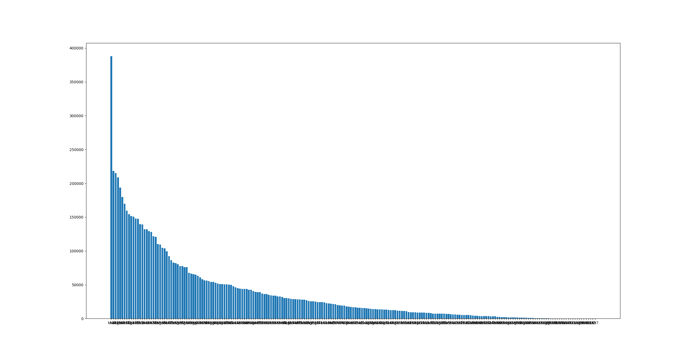

It was expected that some moves would be over-represented as all games finish on the edge of the board and most of them specifically in one of the two white corners. However this looks quite extreme and I suspect it may make the model overfit to some moves

The dataset was shuffled and I used 80% for training and 20% for validation

## Training the model

I trained the models with the following parameters:

```python
batchSize = 512
lr = 1e-4
wd = 1. 
betas = (0.9, 0.98)
```

I copied most of the training code from the [Grokking demo colab](https://colab.research.google.com/github/neelnanda-io/TransformerLens/blob/main/demos/Grokking_Demo.ipynb) and played a bit with the learning rate before I settled on 1e-4 and unleashed the full power of my RTX 4070 (lol). *However I didn't consider the weight decay which now I consider a big mistake*. Did I say this was the first time I was training a model?

For batch size I put the largest number that seemed to fit onto my GPU.
I trained for **190k iterations**.

For the loss function I used the built-in cross entropy loss on the whole sequence. In retrospect I think I could have calculated the loss only on the white's move predictions, this way the model would not have wasted resources trying to learn how to predict the black's moves as well.

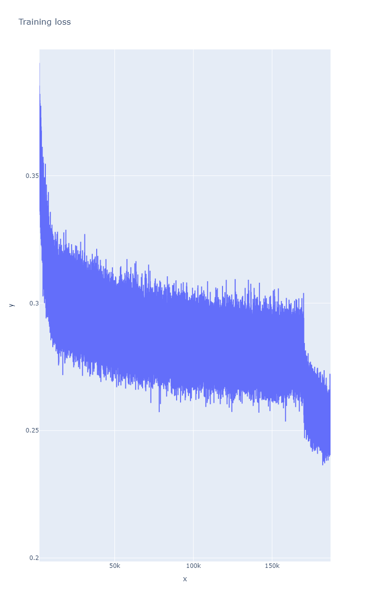

After 160k batches I decreased the learning rate to 1e-5 and that seemed to improve the learning

## Model performance

The model was able to produce a **legal move** in **99%** of the cases

The model was able to produce a **checkmate** in **72%** of the games **vs random defense** and **69% vs optimal defense**

After playing few games with the model I noticed that the model has well learned the algorithm and was methodically cornering my king into the white corner. The first few moves seemed sub-optimal but once my king was forced on the edge of the board it seemed that the model was producing optimal moves.
Something that I found interesting was that *it seemed that the model was able to detect when its pieces were in danger* and always moved them out of the way. I was not able to capture its piece a single time.

The code I used for sampling is [here](https://github.com/VasilGeorgiev39/MechInterp/blob/main/sampler.py)

## Exploration

### General observations

Let's start with a game that I played as black against the model. My strategy for the game was to try to capture the enemy's bishop. The model was successful at detecting when the bishop was in danger and moving it out and was ultimately able to reach a checkmate.

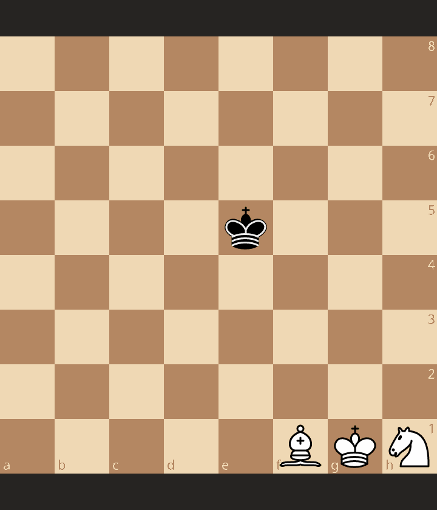

[Link to game](https://lichess.org/study/ruqNokDo/nnb9HfBr)

<sub>Sidenode: It was weird to get checkmated by a small GPT-2 model, I don't know how to feel about this</sub>

Note the moves 4,6,8 and 11 in which the model detects that the bishop is in danger and moves it out. Those would be interesting to check out.

Let's take a particular move for example and see what is going on. I generated the log probabilities of all moves from that position.


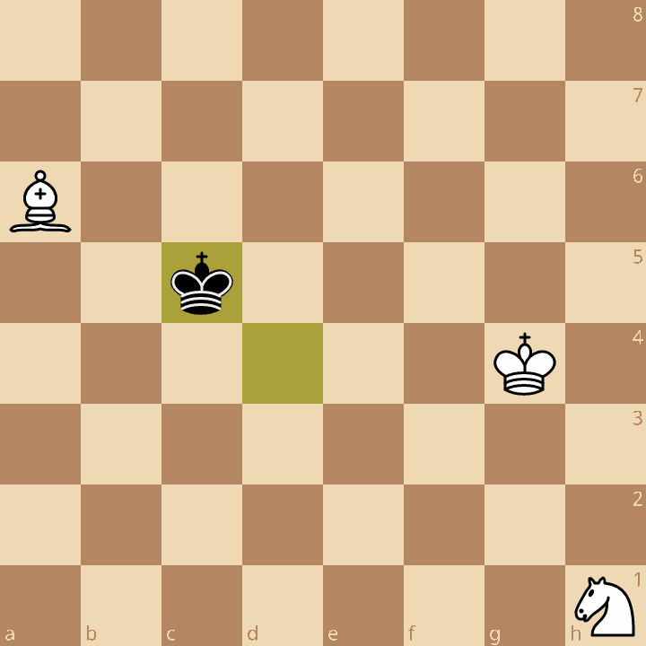 


It seems the model is considering mostly legal moves but that is not yet an evidence that it actually understands the game, it is very plausible that it has figured out that "Ba6" can sometimes be followed by "Be2" but never by "Bg4"

Next I generated the log probabilities for all positions in that game.

You can find them [here](https://github.com/VasilGeorgiev39/MechInterp/tree/main/visualisations/game_log_probs)

[The HTML version](https://github.com/VasilGeorgiev39/MechInterp/blob/main/Absent%20World%20Representations.html) of this doc has a nice script that lets you browse the log probabilities for each move but it is very heavy to load

Few observations:

- It seems that the model well understands whose turn it is and suppresses the probabilities of the opponent's moves
- The model considers mostly legal moves and usually has only 1 or 2 with very high probability. It would be interesting to figure out at which point the filtering of the illegal moves happens
- When predicting the black king's moves it correctly supresses the probabilities of squares that are attacked by the bishop. It would be interesting to check if it has learned it because 'Kb5' never follows a 'Be2' or because it understands that 'b5' is a place that can be occupied by both the king and the bishop. One way to test this would be to put the Bishop on e2 but block it's way with something, like Nd3 and see if the model will correctly figure out that the b5 square is now available
- When the bishop is under attack it's probabilities seem to be boosted and the other pieces' seem to be suppressed (with one notable exception on Move 10). It would be interesting to explore how that happens

Here are some particular examples:

**Suppressing probabilities of squares that are attacked**

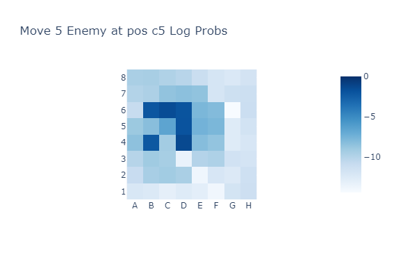

Bishop at A6 suppresses the probabilities for the black king to move to B5 and C4

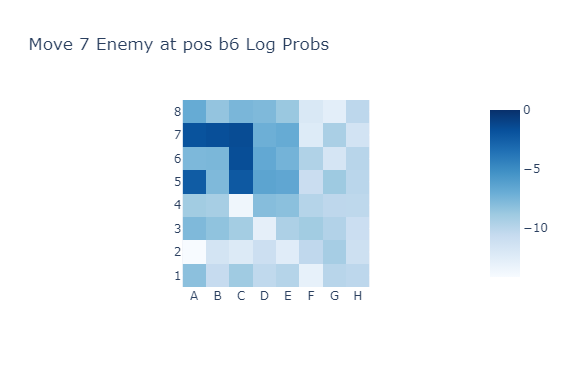

Bishop at D4 suppresses the probabilities for the black king to move to A6 and B5

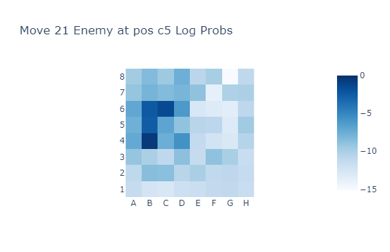

Bishop at F7 suppresses the probabilities for the black king to move to D5 and C4


**Bishop is attacked - probabilities of the other pieces are suppressed**

Bishop on A6 is attacked by the king on B6 and the probabilities of all the other pieces seem suppressed

**Interesting case when the bishop is attacked but the knight can defend it and the knight is suddenly activated**


Bishop on D3 is attacked by the king on D4 but this time the knight is 'activated' as it can protect the Bishop with Nf2!

## Logit attribution

I wanted to understand more which parts of the model are the most important for its decisions. I decided to take an example of a position where there is clearly 1 good move (the position just before checkmate) and see what contributes to that move's probability.


For this section I closely followed ARENA's [[1.3] Indirect_Object_Identification](https://arena-ch1-transformers.streamlit.app/[1.3]_Indirect_Object_Identification) tutorial

### Logit difference

In this position the best move is mate in one 'Bc6'. I decided to compare it to a move that is very close but not checkmate and so picked 'Bb5' as the 'corrupted' input.
Then I calculated the residual directions for the correct and incorrect prediction and subtracted them.

### Accumulated residual stream

I used that on the accumulated residual stream to see how the model performs until each layer.
 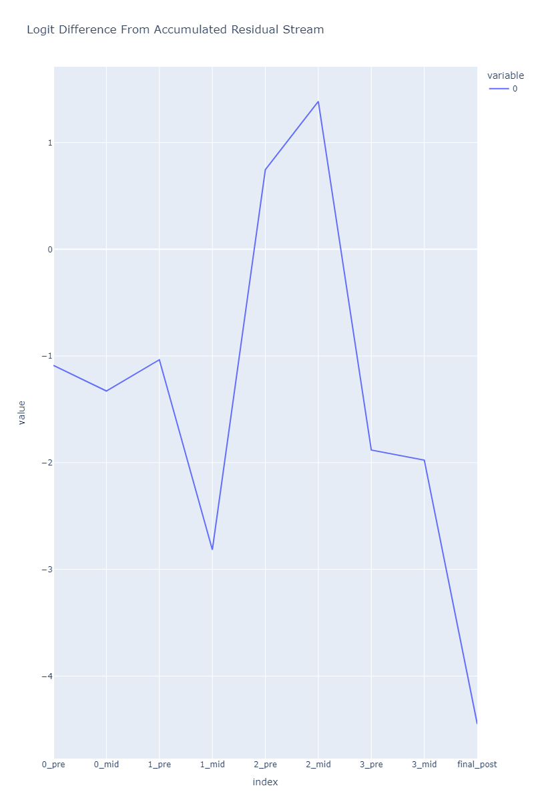

This seems off but I can't find my mistake :( Or I should have compared the 'best' move against multiple others?

### Layer attribution

I also did the same but for each layer instead of the accumulated.

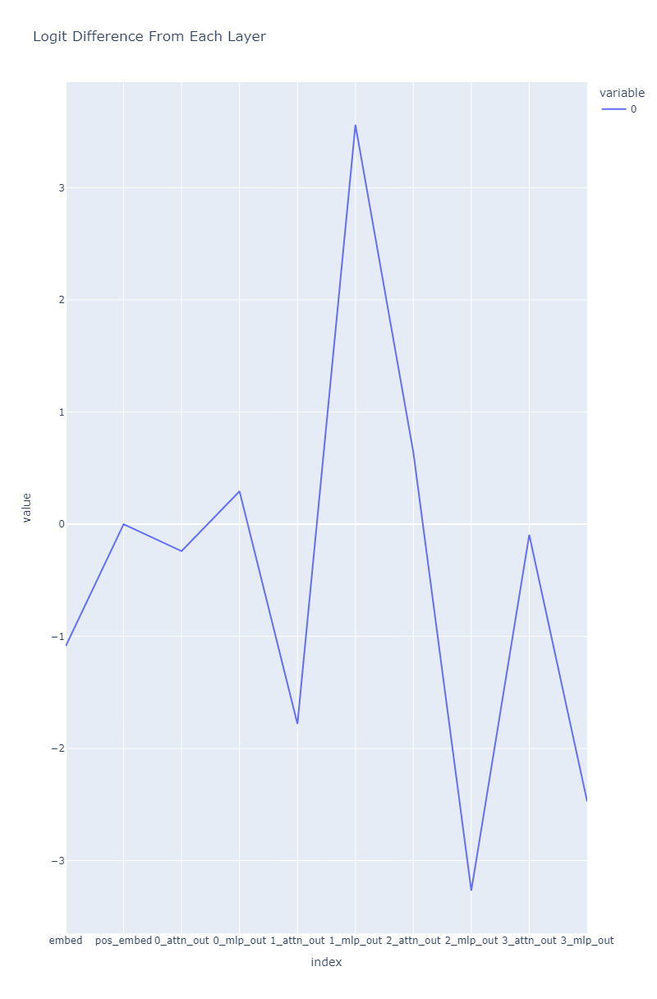

MLP1 super positive and MLP2 super negative? I must have a mistake somewhere. Or is it just a case of transformers be transformin'?

### Head attribution

I further broke down the output of each attention layer into the sum of the outputs of each attention head

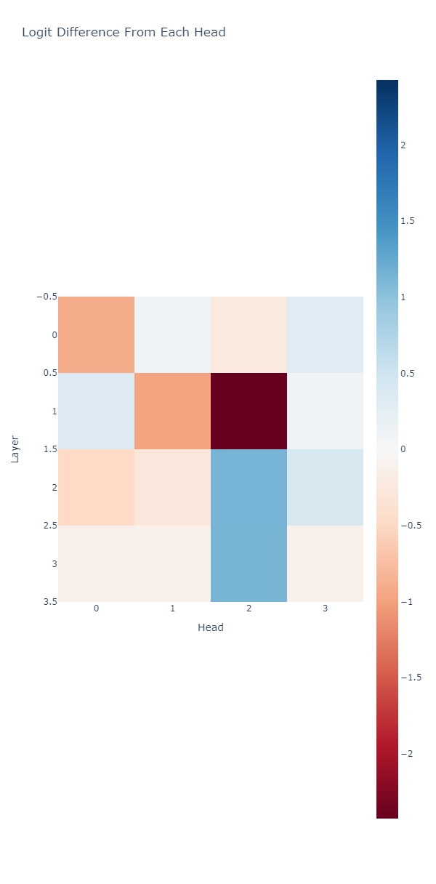

L1H2 is feeling quite negative

## Attention patterns

Used the awesome circuitsvis to visualize the attention patterns


The very negative L1H2 seems to activate on some particular moves for some reason. I couldn't see nothing special about those moves :(

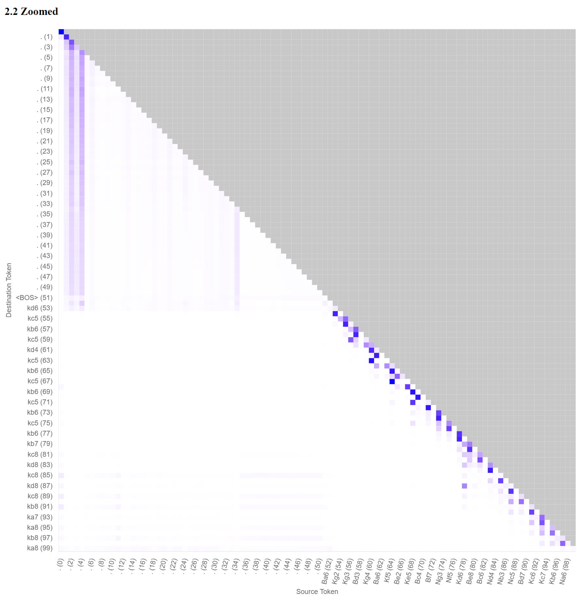
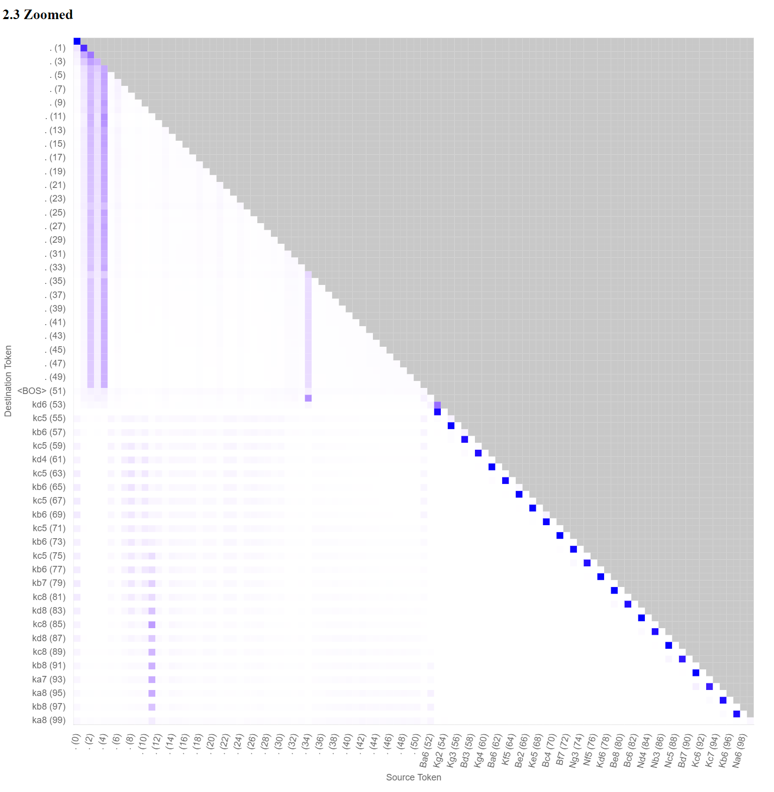

L2H2 and L3H3 look suspiciously like induction heads to me

## Activation patching

For this section I closely followed ARENA's [[1.6] OthelloGPT](https://arena-ch1-transformers.streamlit.app/[1.6]_OthelloGPT) tutorial

I wanted to understand more how the model decides which moves are legal and which are not. I decided to use activation patching to try to localise which part of the model is responsible for that.

I chose the following example:


Here the last move from black was 'kb7' to which the model predicts 'Kb5'. I wanted to patch it so that black's last move was 'kb6' (which makes the following 'Kb5' illegal) and see which layers change the output significantly.

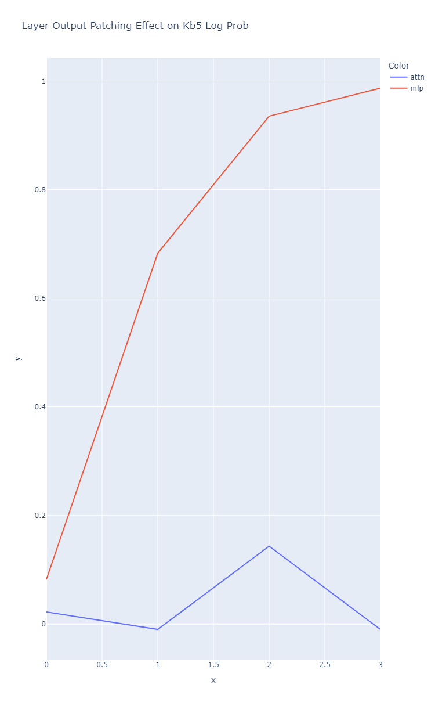

Similar to the work on the Othello model the difference comes only from the MLP layers and nothing comes from the attention layers. Most of the work seems to happen in the second layer


### Linear probing

This was supposed to be the most interesting part and the one that would hopefully show real results, however I terribly failed in training a probe in the allocated time (sadface)
This will remain for future work

## Summary

I trained a small (3 million parameters) GPT-2 style model to play bishop-and-knight chess endgames.
- The model was producing a legal move in 99% of the cases
- The model was reaching a checkmate in 72% of the games

There was some interesting information on the surface but more time would be needed to zoom into the details.

Looking at the log probabilities of the possible moves it seemed like the model had good understanding of who's turn it is, which are the possible legal moves and if a piece is under attack, however this could have been learned by finding statistical patterns from the moves.

Visualizing attention patterns showed that heads L2H2 and L3H3 are likely induction heads.

Using activation patching showed that the calculation if a move is legal or not happens mostly in the second MLP layer.

In conclusion I don't think I have found strong evidence for emerging world representations in this model, but I think this is mainly to the limited time spent on the project and my failure to train a linear probe. I think that further work is likely to uncover such representations.


